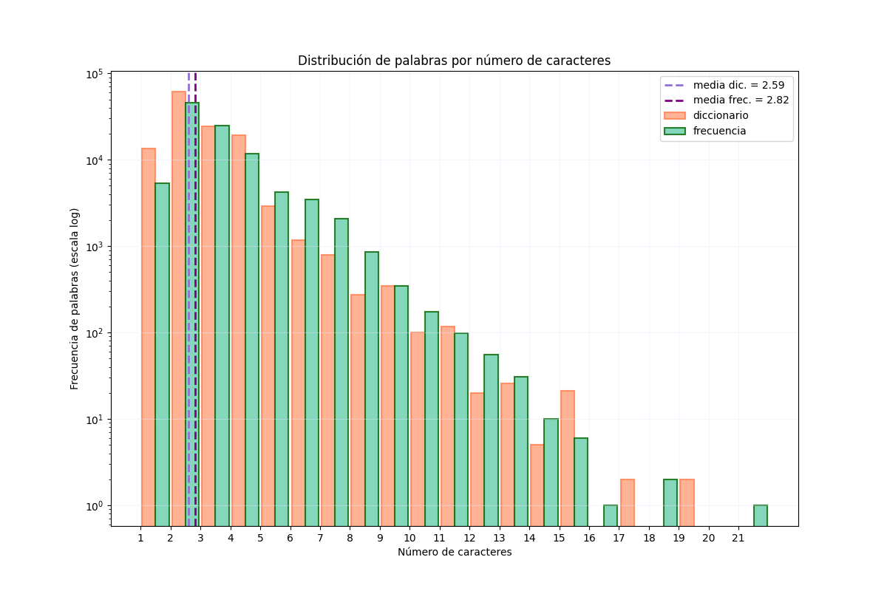
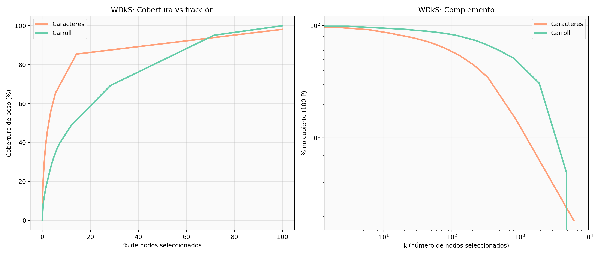
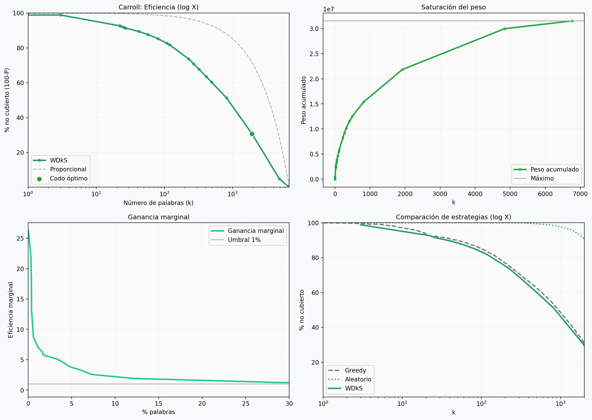

# Chinese Core Networks

> **The Minimum Core of Chinese**: Complex network analysis applied to Mandarin Chinese bisyllabic vocabulary to identify an optimal minimal subset of characters that maximizes corpus coverage.

---

##  Abstract

This project applies **complex network analysis** to Mandarin Chinese vocabulary to identify a **minimal subset of characters** that maximizes coverage of the analyzed bisyllabic corpus. Using the [CEDICT](https://www.mdbg.net/chinese/dictionary?page=cedict) dictionary and the [SUBTLEX-CH](https://www.ugent.be/pp/experimentele-psychologie/en/research/documents/subtlexch) frequency corpus, we construct a **weighted graph** where nodes are characters and edges represent their co-occurrence in two-character words.

The **Weighted Densest k-Subgraph (WDkS)** problem is solved via a **grand canonical relaxation** that reduces the NP-hard problem to a sequence of minimum cuts. We compute centrality metrics (degree, betweenness) and reveal a **core-periphery structure**: approximately **1,045 characters** (16.9% of the total) cover **89.3%** of the network weight.

Characters with highest betweenness, such as 子 (child/suffix), 大 (big), and 人 (person), exhibit high positional combinatoriality, suggesting that early learning of these "lexical multipliers" could facilitate compound inference. We propose a **hierarchical pedagogical model** based on structural centrality and discuss its relation to HSK proficiency levels.

**Keywords**: complex networks, Mandarin Chinese, WDkS, betweenness centrality, language learning

---

## 1. Introduction

Mandarin Chinese challenges conventional vocabulary learning strategies. Extensive dictionaries collect tens of thousands of characters, yet daily usage concentrates on a few thousand: an educated native speaker typically recognizes 4,000–6,000 characters, and about 2,000 are sufficient for daily life.

The traditional recommendation of studying characters in order of **raw frequency** underexploits the strongly **compositional nature** of the language, where most words are compounds of two or three characters. Consequently, a character like 子 (zǐ), which appears as a suffix in hundreds of frequent words, may be pedagogically more valuable than a very common grammatical particle with less compact structural function in the bisyllabic graph, such as 的 (de).

This intuition can be formalized through **complex network theory**: if we model characters as nodes and their co-occurrence in words as weighted edges, centrality metrics quantify the structural importance of each character, and optimization problems like the **Weighted Densest k-Subgraph (WDkS)** identify subsets that maximize language coverage with the minimum possible number of characters.

In this work, we build and analyze the **character co-occurrence graph** of Chinese from the CEDICT dictionary and the SUBTLEX-CH corpus of real frequencies. We work exclusively with **two-character words** because, as shown in Figure 1, they are the most frequent both in the dictionary and in actual usage, concentrating 80% of items.

> **Methodological note**: This restriction must always be kept in mind—the results refer to the **bisyllabic vocabulary** and not to the language as a whole.

### Figure 1: Word Length Distribution





*Figure 1: Distribution of word length in the CEDICT dictionary (salmon) and the SUBTLEX-CH frequency corpus (green). Two-character words dominate both sets, justifying the restriction to this length. Dashed lines show mean lengths (dictionary: 2.59, frequency: 2.82).*

---

## 2. Data and Graph Construction

We use two complementary resources:

| Resource | Description | Size |
|----------|-------------|------|
| **CEDICT** | Chinese-English dictionary with simplified/traditional forms, pinyin, and translations | 124,406 entries |
| **SUBTLEX-CH** | Word frequency list from movie subtitles, reflecting real colloquial register | 99,121 words |

From CEDICT we extract the **58,850 words of exactly two characters**, which constitute the most productive length in Chinese. To weight connections we use SUBTLEX-CH, which lists word frequencies from movie subtitles, thus reflecting real colloquial usage.

### 2.1 Character Graph (G₂)

Combining both resources, we construct the undirected weighted graph G₂ = (V, E, w) where:
- V is the set of **6,167 distinct characters**
- An edge {a,b} exists if a and b appear together in at least one dictionary word
- The weight w(a,b) is the **sum of SUBTLEX-CH frequencies** of all words containing both characters

The **total network weight** is W_tot ≈ 1.58 × 10⁷, interpreted as an aggregate measure of weighted co-occurrence in colloquial speech.

### 2.2 Carroll Word Graph (G_Carroll)

We also construct a **word graph** inspired by Lewis Carroll's word games. Two two-character words are connected if they differ in exactly one character. For example:
- 大人 (dàrén, adult) ↔ 大学 (dàxué, university): share first character 大
- 孩子 (háizi, child) ↔ 桌子 (zhuōzi, table): share second character 子

We take the 10,000 most frequent words from SUBTLEX-CH, keeping only those that also appear in CEDICT as exactly two-character words. This filter reduces the set to **6,774 nodes**. This network, denoted G_Carroll, has edges between words differing in exactly one character; its total weight is about three times that of G₂, but as we shall see, its weight concentration capacity is much lower.

---

## 3. Network Topology of G₂

Despite having thousands of nodes, G₂ is a **compact and highly connected network**:

| Property | Value |
|----------|-------|
| Nodes | 6,167 |
| Giant component | 100% of nodes |
| Average degree | ≈ 19.7 |
| Average clustering coefficient | 0.087 |
| Network radius | 5 hops |
| Diameter | ≈ 10 |

The **degree distribution** is very heterogeneous, with a long tail reflecting the presence of **hyperconnected hubs**. The low clustering coefficient (⟨C⟩ = 0.087) is typical of **hierarchical networks** where few central nodes connect peripheral communities.

### 3.1 Centrality Metrics and Morphological Asymmetry

Centrality metrics reveal a clear **morphological asymmetry**. The following table shows the five characters with highest betweenness:

| Character | Betweenness | Total Degree | k_in | k_out | Positional Role |
|-----------|-------------|--------------|------|-------|-----------------|
| 子 (zǐ) | 0.027 | 676 | 639 | 37 | **Productive suffix** |
| 大 (dà) | 0.021 | 422 | 80 | 342 | **Generative prefix** |
| 水 (shuǐ) | 0.017 | 385 | 224 | 161 | Semantic core |
| 人 (rén) | 0.016 | 414 | 307 | 107 | Semantic core |
| 头 (tóu) | 0.016 | 346 | 266 | 80 | Suffix/core |

In all of them, **in-degree and out-degree differ notably**, allowing classification by positional combinatorics:
- **子** receives 639 incoming connections and only 37 outgoing, confirming its role as a **productive suffix** in words like 孩子 (child), 桌子 (table), 椅子 (chair)
- **大** emits 342 outgoing connections, behaving as a **prefix** generating terms like 大人 (adult), 大学 (university), 大概 (probably)

This behavior is **not visible in a pure frequency list**, where 子 appears in position 8 and 大 in position 12, while 的 (the most frequent particle) occupies first place but has **155 times lower betweenness**.

### Figure 2: Centrality Statistics — G₂ vs G_Carroll

```markdown

```

*Figure 2: Centrality statistics. Left: G₂ (character network)—degree distribution, log₁₀(betweenness), and degree vs betweenness scatter. Right: G_Carroll (word network)—same panels. The strong degree-betweenness correlation in G₂ (r ≈ 0.85) contrasts with the more symmetric, concentrated distribution in G_Carroll.*

---

## 4. The WDkS Problem and Its Solution

The **Weighted Densest k-Subgraph (WDkS)** seeks, given a weighted graph G = (V, E, w) and an integer k, the subset S ⊂ V with |S| = k that maximizes the sum of internal edge weights Σ_{i,j ∈ S} w_{ij}.

Since this is an **NP-hard problem**, we employ a **grand canonical relaxation**:

1. Map the problem to a **ferromagnetic Ising model**: each node i is assigned a spin variable s_i ∈ {-1, +1} where s_i = +1 indicates the node belongs to the selected subset.
2. The system energy includes a **ferromagnetic interaction term** J_{ij} = w_{ij}/4 that favors connected nodes sharing the same spin, and an **external field** h that controls subset size:

```
H = -Σ_{⟨i,j⟩} J_{ij} s_i s_j - h Σ_i s_i,    J_{ij} = w_{ij}/4
```

3. Varying h from very negative (few nodes selected) to very positive (all selected), and solving a **minimum cut** in the associated flow network at each step (which is polynomial), we obtain the complete coverage curve P̄(m) as a function of the node fraction m = k/N.

---

## 5. The Minimum Core

Figure 3 shows the WDkS result for G₂, representing the **percentage of uncovered weight** versus the number of characters k. We work with percentages rather than absolute figures because the relevant question is not "how many characters must one learn?" but "what fraction of the total characters do I need to master a given fraction of the language?"

### Figure 3: WDkS Results for G₂

```markdown

```

*Figure 3: WDkS results for G₂. (a) Optimal selection efficiency; the green dot marks the optimal elbow (k* ≈ 1045). (b) Vocabulary saturation: accumulated weight vs number of characters. (c) Marginal gain per additional character. (d) Strategy comparison: WDkS (optimal, blue), greedy by degree (orange), and random (green).*

The curve shows that the **optimal selection efficiency is overwhelming** compared to a proportional (random) choice:

| Selection | Characters | % of Total | Coverage |
|-----------|-----------|------------|----------|
| Random 17% | 1,045 | 17% | ~17% |
| **WDkS optimal** | **1,045** | **16.9%** | **89.3%** |
| WDkS (80% threshold) | 1,010 | 16.4% | 80% |
| WDkS (90% threshold) | 1,082 | 17.5% | 90% |

The **maximum curvature point (elbow)** is located at k* = 1,045 characters, representing barely 16.9% of the total. These figures define an **extremely compact minimum core** of colloquial Chinese.

---

## 6. Comparison with Other Strategies and with the Carroll Network

To evaluate WDkS utility, we contrast it with two simpler methods:

1. **Greedy selection by degree**: adds nodes in decreasing degree order
2. **Completely random selection**

Surprisingly, the **greedy curve is almost identical to WDkS** (Figure 3d). This is explained by the **strong degree-weight correlation** in this network: the morphological hubs (子, 大, 人) are simultaneously the most connected nodes and those accumulating the highest-frequency edges. This limits the practical advantage of WDkS over simple degree ranking in the character graph, but validates that connectivity-based methods capture the essence of the problem.

### Figure 4: WDkS Comparison — G₂ vs G_Carroll

```markdown

```

*Figure 4: WDkS curves: G₂ (characters, salmon) vs G_Carroll (words, green). The character network concentrates weight much more efficiently. For 80% coverage, G₂ needs ~16% of nodes while G_Carroll needs >40%.*

The comparison with the Carroll network reinforces this interpretation. In G_Carroll, weight concentration is much lower:
- To reach 80% coverage, more than **40% of nodes** are needed
- The elbow is at **1,923 words (28.4%)** with only **69.3% coverage**

The difference lies in that in G₂, characters act as true **"atoms" of language**, while in the full word network, edges connect vocabulary items that only differ in one character, giving rise to more homogeneous connectivity.

### Figure 5: WDkS for G_Carroll

```markdown

```

*Figure 5: WDkS for G_Carroll. Lower weight concentration manifests in a less pronounced elbow and greater fraction of nodes needed for equivalent coverages.*

---

## 7. Implications for Chinese Language Teaching

The results allow articulating a **pedagogical model prioritizing structural centrality**, but it is crucial to distinguish between a node's importance in the network and its real didactic priority, which must be validated with external criteria (coverage in independent texts, ease of learning, transfer).

With that caution, a student could follow this **hierarchical learning path**:

### Phase 1: Lexical Multipliers (~5 characters)
Learn characters with highest betweenness—**子, 大, 人, 水, 头**—which act as **"lexical multipliers"** due to their high positional combinatoriality. With just five characters, one acquires the ability to infer the meaning of dozens of common compounds.

### Phase 2: Morphological Functions (~50–100 characters)
Explicit the **morphological function** of each character, distinguishing:
- **Suffixes** (high in-degree): 子, 头, 气
- **Prefixes** (high out-degree): 大, 小, 新
- **Semantic cores** (balanced degree): 人, 水, 心, 手

### Phase 3: Complete Core (~1,045 characters)
The core of about 1,000 characters constitutes the base upon which **thematic specializations** (medicine, science, politics) can be built, since beyond this point, the addition of peripheral characters contributes little to general language coverage.

### Relation to HSK Levels

This core relates naturally to the official **HSK (Hànyǔ Shuǐpíng Kǎoshì)** proficiency levels:

| HSK Level | Words | Approx. Characters | Our Core |
|-----------|-------|-------------------|----------|
| 1–2 (Basic) | 150–300 | ~150–300 | Phase 1–2 |
| 3–4 (Intermediate) | 600–1,200 | ~600–1,200 | **Phase 3** |
| 5–6 (Advanced) | 2,500–5,000+ | ~2,500+ | Core + specialization |

Although HSK counts words and our study is character-based, the set of 1,045 characters allows forming a bisyllabic vocabulary that **far exceeds the intermediate threshold**, suggesting that a **structural-centrality-based selection** could accelerate acquisition of required competencies.

---

## 8. Conclusions

We constructed and analyzed the **co-occurrence graph of 6,167 Chinese characters**, weighted by usage frequency in the colloquial SUBTLEX-CH corpus and restricted to two-character words. The network exhibits a **marked core-periphery architecture**, with a small set of morphological hubs dominating global connectivity.

The WDkS solution reveals that about **1,045 characters** (16.9% of the total) suffice to cover **89.3% of total weight**, constituting a **minimum core of spoken bisyllabic vocabulary**.

Centrality metrics, especially **betweenness**, capture the combinatorial importance of a character better than raw frequency, as they identify characters with high **positional productivity** that enable lexical inference. Although in this graph the greedy degree algorithm matches WDkS performance due to the degree-weight correlation, the network approach provides a **solid quantitative framework** for optimizing learning order and opens the door to comparative studies in other languages and registers.

---

##  Future Work

- [ ] Extend analysis to 3- and 4-character words
- [ ] Empirical validation via controlled trials with CSL (Chinese as Second Language) students
- [ ] Comparative study with other compositional languages (Korean, Japanese)
- [ ] Interactive web application for exploring the character graph
- [ ] Integration with spaced repetition systems (Anki, Pleco)

---

##  Repository Structure

```
chinese-core-networks/
├── data/ 
│   ├── CEDICT.txt              
│   └── SUBTLEX-CH.txt
├── scripts/
│   ├── histograma.py             
│   ├── grafos.py                 
│   ├── game.py                   
│   └── comparacion.py            
├── results/
|   # may past also the stas (.csv) that generate by yourself
│   └── figures/ # names are different on the script                  
│       ├── histograma.png
│       ├── estadisticas_g2.png
│       ├── figura_principal_wdks.png
│       ├── comparacion_wdks.png
│       └── carroll_wdks.png
├── paper/
│   └── articulo.pdf
├── README.md
└── requirements.txt
```
> **On the scripts the paths are differents**, this is just an example of how to configure

---

##  Quick Start

### Requirements

```bash
pip install -r requirements.txt
```

```
numpy>=1.21.0
pandas>=1.3.0
matplotlib>=3.4.0
networkx>=2.6.0
scipy>=1.7.0
```

### Data Download

1. **CEDICT**: Download from [MDBG](https://www.mdbg.net/chinese/dictionary?page=cedict)
2. **SUBTLEX-CH**: Download from [Ghent University](https://www.ugent.be/pp/experimentele-psychologie/en/research/documents/subtlexch)
3. Place both files in the `data/` directory

### Execution

```bash
python scripts/histograma.py      # Generate Figure 1
python scripts/grafos.py            # Generate Figures 2–3, G2 metrics, WDkS
python scripts/game.py              # Generate Figures 4–5, Carroll metrics, WDkS
python scripts/comparacion.py       # Generate final comparison figure
```

---

##  References

1. Packard, J. L. (2000). *The Morphology of Chinese*. Cambridge University Press.
2. Newman, M. E. J. (2010). *Networks: An Introduction*. Oxford University Press.
3. CEDICT Chinese-English Dictionary. [https://www.mdbg.net/](https://www.mdbg.net/)
4. Cai, Q. & Brysbaert, M. (2010). SUBTLEX-CH: Chinese word and character frequencies based on film subtitles. *PLoS ONE*, 5(6), e10729.
5. Wang, J. & Li, H. (2020). Weighted dominating k-set problem. *Physica A*, 553, 124219.
6. HSK Chinese Proficiency Test. [https://www.chinesetest.cn/](https://www.chinesetest.cn/)

---

##  Author

**Germán D. Rojas Lam**  
Faculty of Physics, University of Havana, Cuba  
gdavid.rojaslam@gmail.com

---

---
